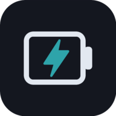
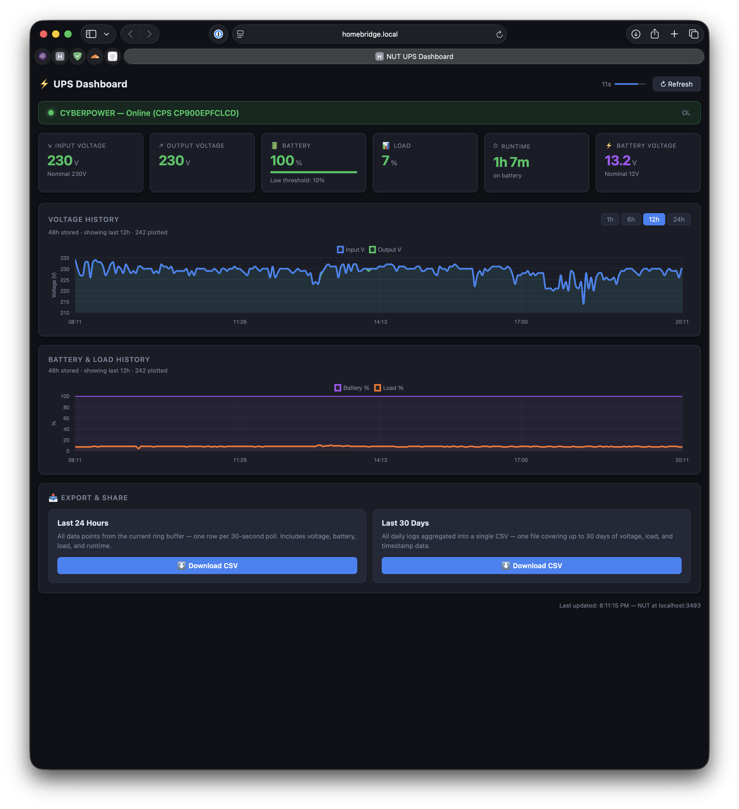
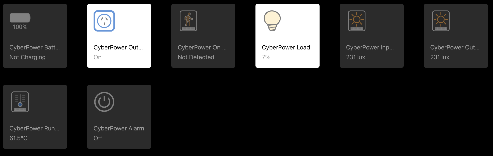
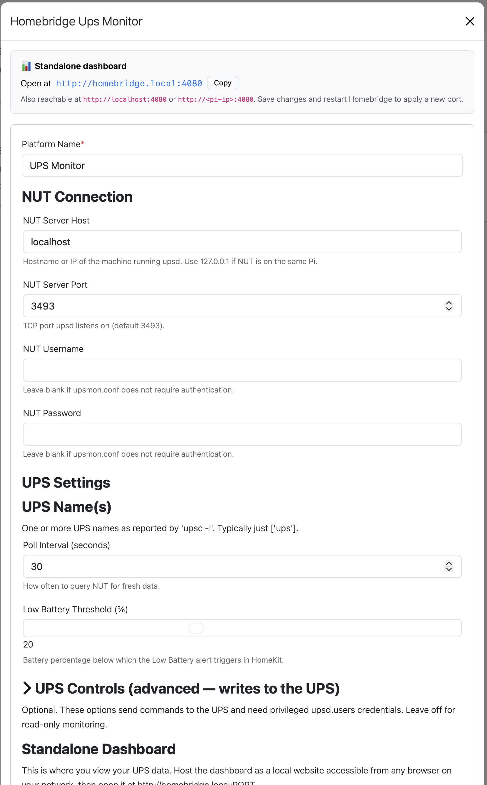

<p align="center"></p>

# homebridge-ups-monitor

[](https://www.npmjs.com/package/homebridge-ups-monitor)
[](https://www.npmjs.com/package/homebridge-ups-monitor)
[](https://github.com/GodIsI/homebridge-ups-monitor/actions/workflows/ci.yml)
[](https://socket.dev/npm/package/homebridge-ups-monitor)

A Homebridge platform plugin that monitors your **UPS (Uninterruptible Power Supply)** via [NUT (Network UPS Tools)](https://networkupstools.org/), exposing it as a native HomeKit accessory and providing a **standalone web dashboard** you can open from any browser on your network.

Built for Raspberry Pi setups running NUT alongside Homebridge, and pairs well with solar/battery monitoring projects.

---

## Features

- **Standalone web dashboard**: input/output voltage, battery %, load %, runtime remaining, battery voltage, and history charts, served as a local website you can open from any browser on your network
- **HomeKit Battery service**: battery level, charging state, and Low Battery alerts usable in automations
- **HomeKit Outlet service**: shows whether the UPS is supplying power; load > 0 marks it as in use
- Connects over the native **NUT TCP protocol** (port 3493), with no extra agents needed, just `upsd` running on your Pi
- Supports **multiple UPS units** on the same NUT server
- Configurable **poll interval** and **low battery threshold**
- History charts with selectable **1h / 6h / 12h / 24h** ranges, backed by a persistent ~24h server-side ring buffer
- **Outage timeline** with latest outage status, duration, battery impact, acknowledgement, and clear controls

---

## Screenshots

**Standalone dashboard**: live cards + selectable 1h / 6h / 12h / 24h history charts and CSV export, in any browser:



| HomeKit tiles (Apple Home) | Plugin settings |
|---|---|
|  |  |

The dashboard works from any device on your network and can be added to a phone or tablet home screen. In Apple Home, each UPS metric appears as a native tile (battery, outlet, on-battery, load, input/output voltage, runtime, and optional alarm).

---

## Requirements

- [Homebridge](https://homebridge.io) ≥ 1.6.0
- Node.js ≥ 18
- A running NUT server (`upsd`) accessible over TCP, typically on the same Pi as Homebridge

Verify NUT is reachable before installing:

```bash
upsc ups@localhost
```

---

## Installation

### Via Homebridge UI (recommended)

Search for **"UPS Monitor"** in the Homebridge plugin store and click **Install**.

### Via npm

```bash
sudo npm install -g homebridge-ups-monitor
```

### Local development

```bash
git clone https://github.com/GodIsI/homebridge-ups-monitor.git
cd homebridge-ups-monitor
sudo npm install -g .
```

---

## Configuration

Add the platform to your Homebridge `config.json`, or use the **Settings** panel in the Homebridge UI:

```json
{
  "platforms": [
    {
      "platform": "NUTDashboard",
      "name": "UPS Monitor",
      "host": "127.0.0.1",
      "port": 3493,
      "ups": ["ups"],
      "pollInterval": 30,
      "lowBatteryThreshold": 20,
      "standalonePort": 4080
    }
  ]
}
```

### Options

| Key | Default | Description |
|-----|---------|-------------|
| `host` | `127.0.0.1` | Hostname or IP of the machine running `upsd`. Use `127.0.0.1` if NUT is on the same Pi as Homebridge. |
| `port` | `3493` | TCP port `upsd` listens on. |
| `username` | _(none)_ | NUT username; leave blank if your `upsd.conf` does not require auth. |
| `password` | _(none)_ | NUT password. |
| `ups` | `["ups"]` | Array of UPS names as shown by `upsc -l`. Usually just `["ups"]`. |
| `pollInterval` | `30` | Seconds between NUT queries for HomeKit updates. |
| `lowBatteryThreshold` | `20` | Battery % below which the HomeKit Low Battery alert fires. |
| `standalonePort` | _(disabled)_ | Port for the standalone dashboard web server (1–65535). When set, the dashboard is served at `http://homebridge.local:PORT` and accessible from any browser on your network, with no Homebridge UI required. Leave blank to disable. |

---

## Dashboard

The dashboard runs as a **standalone web server**: set a **Standalone Dashboard Port** (`standalonePort`) in the plugin settings, save, and restart Homebridge:

```json
"standalonePort": 4080
```

Once Homebridge restarts, open it from any device on your network (phone, tablet, or desktop):

| URL | Use case |
|-----|----------|
| `http://homebridge.local:4080` | From any device on your local network (mDNS name) |
| `http://localhost:4080` | From the Pi itself |
| `http://<pi-ip>:4080` | If mDNS isn't working, replace with your Pi's IP address |

You'll see:

- Status banner (Online / On Battery / Low Battery) with UPS model name
- Live metric cards: input voltage, output voltage, battery %, load %, runtime, battery voltage, and latest outage
- Outage timeline with start/end times, duration, battery percentages, acknowledgement, and clear controls
- Voltage and battery/load history charts with selectable **1h / 6h / 12h / 24h** ranges
- CSV export for **Last 24 Hours**, **Last 30 Days**, and **Outage Timeline** data
- Auto-refresh every 15 seconds with a countdown indicator

History is persisted server-side in a ring buffer (about 24 hours at the default 30s poll interval), so it survives page refreshes and Homebridge restarts. Outage events are persisted separately as JSON. Data files (history JSON, outage JSON, and daily CSV logs) live in a dedicated `homebridge-ups-monitor/` subfolder of your Homebridge storage directory.

> **Outage logging note:** the plugin can only record outages while the machine running Homebridge stays powered and online. For useful outage logging, keep your Homebridge host/Raspberry Pi and the NUT server on the UPS being monitored. If the host loses power, the outage timeline may miss the event, miss the recovery time, or show only partial history.

> **Storage location & upgrades:** the storage directory is resolved from the path Homebridge reports (`api.user.storagePath()`), so data is always kept inside your active Homebridge storage folder, including custom `-U` setups. Earlier versions could fall back to `~/.homebridge`; on first launch after upgrading, the plugin automatically moves any history/CSV files left in those previous locations into the current `homebridge-ups-monitor/` folder, so your history carries over. The migration is best-effort and non-destructive: if nothing is found, or files can't be moved, it logs a note and continues.

It can be added to a phone or tablet home screen (it ships a web-app manifest and icons). **To disable**, remove `standalonePort` from your config (or leave it blank) and restart Homebridge.

> **Security note:** The standalone server has no authentication. Only enable it if your home network is trusted or you're comfortable with local network access to your UPS data.

---

## UPS Controls (optional)

By default this plugin is **read-only**. Two opt-in controls can write to the UPS, and both are **off by default** and require privileged NUT credentials in `upsd.users`:

| Option | Effect | Requires |
|--------|--------|----------|
| `alarmControl` | Adds a HomeKit **switch** to enable/disable the UPS audible alarm (beeper) | UPS that advertises `beeper.enable` / `beeper.disable`; `instcmds = ALL` (or the beeper commands) for the user |
| `syncLowBatteryThreshold` | On startup, writes the configured **Low Battery Threshold** to the UPS (`battery.charge.low`) | UPS where `battery.charge.low` is writable; `actions = SET` for the user |

Example `upsd.users` entry for control:

```
[admin]
  password = secret
  actions = SET
  instcmds = ALL
```

If the UPS doesn't advertise the command/variable, or the credentials don't permit control, the plugin logs a warning and skips that control; it never crashes. Many UPSes are monitor-only.

---

## Relationship to `homebridge-ups`

This plugin complements [`homebridge-ups`](https://github.com/ebaauw/homebridge-ups) rather than replacing it. `homebridge-ups` focuses on exposing and **controlling** the UPS inside Apple Home (status, battery, alarm/threshold control, Eve-app history).

`homebridge-ups-monitor` adds an **observability & data-portability** layer that lives outside Apple Home:

- a **standalone web dashboard** reachable from any browser on your network (phone, tablet, desktop), with no Home app or Eve required;
- **history charts** (1h / 6h / 12h / 24h) backed by a server-side ring buffer;
- **CSV / log export** (24h and 30-day daily logs) for spreadsheets and long-term analysis;
- broad **HomeKit tiles** plus optional UPS controls (beeper, low-battery threshold).

If you primarily want in-Home UPS control, `homebridge-ups` is an excellent choice; if you want a cross-platform dashboard and exportable history, use this plugin (the two can run side by side).

---

## NUT Variables Used

| NUT Variable | Dashboard | HomeKit |
|---|---|---|
| `ups.status` | Status banner | ChargingState, Outlet On |
| `input.voltage` | ✓ + chart | — |
| `output.voltage` | ✓ + chart | — |
| `battery.charge` | ✓ + bar | BatteryLevel, StatusLowBattery |
| `ups.load` | ✓ + chart | OutletInUse |
| `battery.runtime` | ✓ | — |
| `battery.voltage` | ✓ | — |
| `ups.model` / `ups.mfr` | Status banner | AccessoryInformation |

---


## HomeKit Tiles

The plugin maps UPS metrics to HomeKit services. Because HomeKit's sensor types have fixed value ranges, some metrics use non-obvious service types; the table below explains the reasoning.

| What you see in Home | HomeKit Service | NUT Variable | Notes |
|---|---|---|---|
| **On Battery** | `OccupancySensor` | `ups.status` | Occupancy Detected = on battery. Use this in automations to trigger alerts or shutdown scripts on power failure. |
| **Battery Level** | `BatteryService` | `battery.charge` | Native battery % + Low Battery alert fires below your configured threshold |
| **Load %** | `Lightbulb` (Brightness) | `ups.load` | 0–100 % maps naturally to brightness; bulb On = load > 0 |
| **Input Voltage** | `LightSensor` | `input.voltage` | `CurrentAmbientLightLevel` spans 0.0001–100,000 lux, wide enough for any AC voltage (120 V or 230 V) without clipping. `CurrentTemperature` caps at 100 °C so would clip mains voltage. |
| **Output Voltage** | `LightSensor` | `output.voltage` | Same reason as input voltage |
| **Runtime Remaining** | `TemperatureSensor` | `battery.runtime ÷ 60` | Runtime reported in minutes (÷ 60). `CurrentTemperature` range 0–100 °C maps well to typical UPS runtimes of 0–100 min. Reported as a float, unlike humidity which is integer-only. |

> **Why not use custom characteristics?** Custom characteristics appear in third-party apps (Eve, Controller for HomeKit) but are invisible in Apple's own Home app. Standard service types ensure every metric is visible and automatable in the native Home app without any workarounds.

---
## Troubleshooting

**Plugin loads but shows "Connection failed"**  
Run `upsc ups@127.0.0.1` on the Pi to confirm NUT is reachable. Check that `upsd` is listening on the configured host/port (`netstat -tlnp | grep 3493`).

**Variables show `–` (dash)**  
Not all UPS models report every variable. Run `upsc ups` to see exactly which variables your hardware exposes.

**"Access denied" errors**  
Set a `username` and `password` in the plugin config matching an entry in `/etc/nut/upsd.users`.

---

## Contributing

Pull requests and issues are welcome on [GitHub](https://github.com/GodIsI/homebridge-ups-monitor/issues).

---

## License

MIT © [GodIsI](https://github.com/GodIsI)
